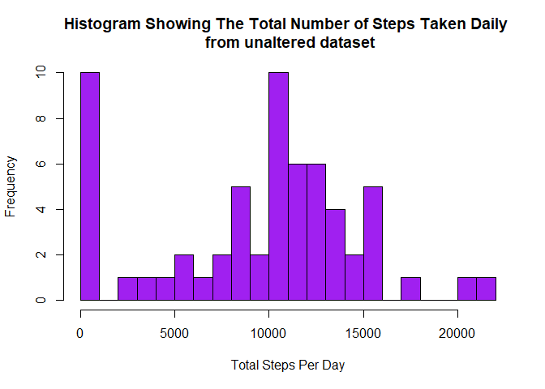
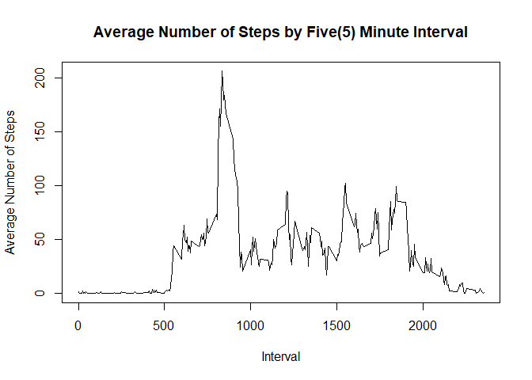
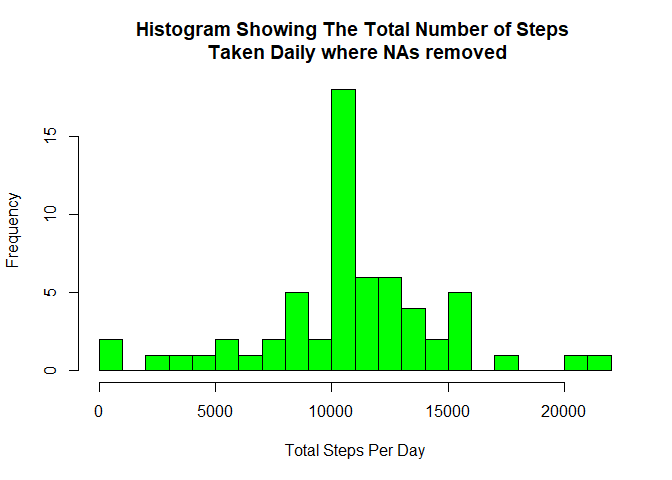
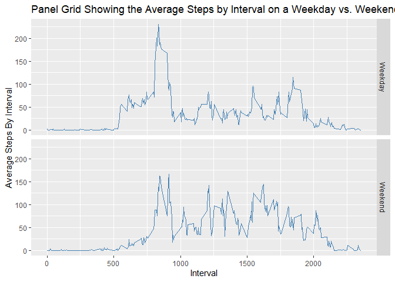

## Loading and preprocessing the data

```r
    library(data.table)
```

```
## Warning: package 'data.table' was built under R version 4.0.3
```

```r
    library(ggplot2)
```

```
## Warning: package 'ggplot2' was built under R version 4.0.3
```

```r
    library(dplyr)
```

```
## 
## Attaching package: 'dplyr'
```

```
## The following objects are masked from 'package:data.table':
## 
##     between, first, last
```

```
## The following objects are masked from 'package:stats':
## 
##     filter, lag
```

```
## The following objects are masked from 'package:base':
## 
##     intersect, setdiff, setequal, union
```

```r
    raw_data <- read.csv("activity/activity.csv")
    data <- data.table(raw_data)
```


## What is mean total number of steps taken per day?


```r
    data_summary <- data[, list(total_steps_per_day = sum(steps, na.rm = TRUE)), by = date]
    mean_steps_per_day <- round(mean(data_summary$total_steps_per_day, na.rm = TRUE), 2)
    median_steps_per_day <- paste(round(median(data_summary$total_steps_per_day, na.rm = TRUE), 2))
```


```r
    hist(x = data_summary$total_steps_per_day,
         main = "Histogram Showing The Total Number of Steps Taken Daily \n from unaltered dataset",
         xlab = "Total Steps Per Day",
         breaks = 20,
         col = "purple",
         )
```

<!-- -->

**Mean** = 9354.23

**Median** = 10395

## What is the average daily activity pattern?


```r
    data_summary_by_interval = data[, list(average_steps_by_interval = mean(steps, na.rm = TRUE)), by = interval]

    plot(x = data_summary_by_interval$interval,
         y = data_summary_by_interval$average_steps_by_interval,
         main = "Average Number of Steps by Five(5) Minute Interval",
         xlab = "Interval",
         ylab = "Average Number of Steps",
         type = "l")
```

<!-- -->

```r
    max_steps_row = data_summary_by_interval[which.max(data_summary_by_interval$average_steps_by_interval),]
```
The 5 minute interval at 835 has a maximum amount of steps of 206.1698113.

## Inputing missing values

1. Calculate and report the total number of missing values in the dataset (i.e. the total number of rows with NAs)


```r
    sum(is.na(data$steps))
```

```
## [1] 2304
```

2. Devise a strategy for filling in all of the missing values in the dataset. The strategy does not need to be sophisticated. For example, you could use the mean/median for that day, or the mean for the 5 minute interval, etc.


```r
# The NA values from the steps column is replaced with the average steps by interval from data_summary_by_interval

    fixed_data_na_removed <- data
    fixed_data_na_removed$steps <- unlist(apply(data, 1, function(data_row) {
        if (is.na(data_row[[1]])) {
            current_missing_interval <- as.numeric(data_row[[3]])
            res <- round(data_summary_by_interval[data_summary_by_interval$interval == current_missing_interval, c(2)], digits = 1)
            return(res)
        }
      return(as.numeric(data_row[[1]]))
    }))
```


3. Create a new dataset that is equal to the original dataset but with the
missing data filled in.


```r
  #Original Data
  head(data)
```

```
##    steps       date interval
## 1:    NA 2012-10-01        0
## 2:    NA 2012-10-01        5
## 3:    NA 2012-10-01       10
## 4:    NA 2012-10-01       15
## 5:    NA 2012-10-01       20
## 6:    NA 2012-10-01       25
```

```r
  #Altered Data where NA removed from Original Data
  head(fixed_data_na_removed)
```

```
##    steps       date interval
## 1:   1.7 2012-10-01        0
## 2:   0.3 2012-10-01        5
## 3:   0.1 2012-10-01       10
## 4:   0.2 2012-10-01       15
## 5:   0.1 2012-10-01       20
## 6:   2.1 2012-10-01       25
```

4. Make a histogram of the total number of steps taken each day and Calculate
and report the mean and median total number of steps taken per day. Do
these values differ from the estimates from the first part of the assignment?
What is the impact of imputing missing data on the estimates of the total
daily number of steps?


```r
  # Create data summary of altered dataset
  altered_data_summary <- fixed_data_na_removed[, list(total_steps_per_day = sum(steps, na.rm = TRUE)), by = date]
  altered_mean_steps_per_day <- paste(round(mean(altered_data_summary$total_steps_per_day, na.rm = TRUE), 2))
  altered_median_steps_per_day <- paste(round(median(altered_data_summary$total_steps_per_day, na.rm = TRUE), 2)) 
```

```r
    hist(x = data_summary$total_steps_per_day,
         main = "Histogram Showing The Total Number of Steps Taken Daily \n from unaltered dataset",
         xlab = "Total Steps Per Day",
         breaks = 20,
         col = "purple",
         )
```

<!-- -->

**Mean** = 9354.23

**Median** = 10395


```r
    hist(x = altered_data_summary$total_steps_per_day,
         main = "Histogram Showing The Total Number of Steps \n Taken Daily where NAs removed",
         xlab = "Total Steps Per Day",
         breaks = 20,
         col = "green",
         )
```

<!-- -->

**Altered Mean** = 10766.19

**Altered Median** = 10766.2

After the removal of the NA's from the original dataset the medians and means differ but the deviation is small. However, the new median and mean has increased relative to the original mean and median from the original dataset.

## Are there differences in activity patterns between weekdays and weekends?


```r
  fixed_data_na_removed$day_name <- weekdays(as.Date(fixed_data_na_removed$date))
  fixed_data_na_removed$day_type <- apply(fixed_data_na_removed, 1, function(row) {
    x <- row[[4]]
    if (x == 'Saturday' || x == 'Sunday') {
      return('Weekend')
    }
    return('Weekday')
  })
  
  ### summarize dataset based on average steps by the interval and daytype
  
  altered_data_summary_by_interval = fixed_data_na_removed[, list(average_steps_by_interval = mean(steps, na.rm = TRUE)), by = c('interval', 'day_type')]
```

Panel Plot


```r
  ggplot(data = altered_data_summary_by_interval, aes(interval, average_steps_by_interval)) +
  geom_line(color = "steelblue", size = 0.5) +
  labs(title = "Panel Grid Showing the Average Steps by Interval on a Weekday vs. Weekend",
       x = 'Interval',
       y = 'Average Steps By Interval') +
  facet_grid(day_type ~ .)
```

<!-- -->

From the Panel plot above it can be seen that there is a difference between the average steps on a weekday vs the average steps on a weekend. On weekdays there is a higher average steps around the 750 - 1000 range vs that on the weekends.
